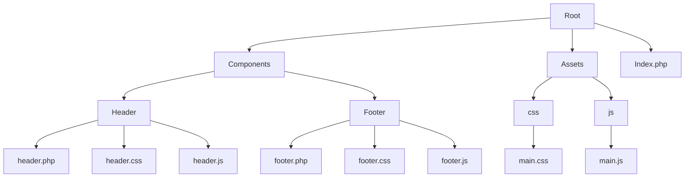
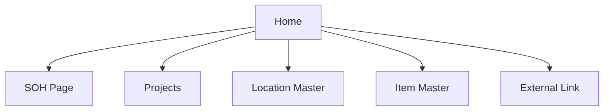
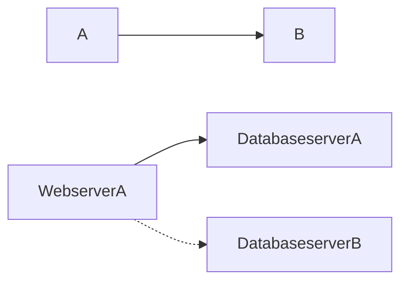

# Program Flow
# Project Structure

### Links to Open Files in Visual Studio Code

- [Home](vscode://file/F:/DEVELOPER/index.php)
- [SOH Page](vscode://file/F:/Main%20Website/soh_page/soh_page.php)
- [Projects](vscode://file/F:/Main%20Website/projects/projects.php)
- [Location Master](vscode://file/F:/Main%20Website/location_master/location_master.php)
- [Item Master](vscode://file/F:/Main%20Website/item_master/item_master.php)
- [External Link](https://www.externalwebsite.com)
