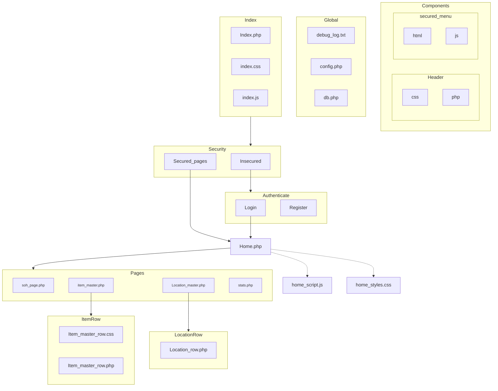

# Project Structure

## Project Files

- [Index.php](index.php)
- Components
  - Header
    - [header.php](developer/components/header/header.php)
    - [header.css](components/header/header.css)
    - [header.js](components/header/header.js)
  - Footer
    - [footer.php](components/footer/footer.php)
    - [footer.css](components/footer/footer.css)
    - [footer.js](components/footer/footer.js)
- Assets
  - CSS
    - [main.css](assets/css/main.css)
  - JS
    - [main.js](assets/js/main.js)
